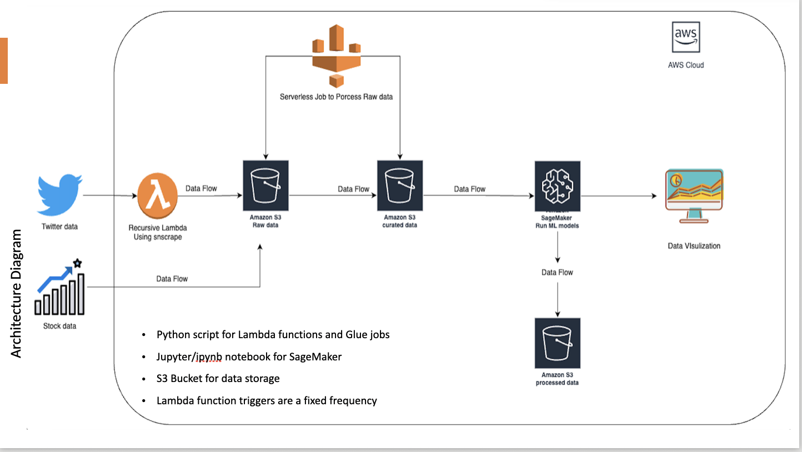
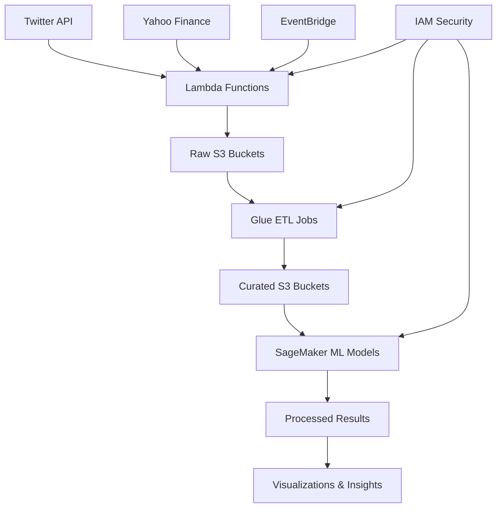

# Sentiment Analysis for Bank Stock Price Prediction - Twitter Tweets


---

## 🎯 Project Overview

This project develops a comprehensive data pipeline that leverages Twitter sentiment analysis to predict bank stock prices, focusing on the 2023 banking crisis events. Analyzed sentiment data from Twitter related to Silicon Valley Bank, Credit Suisse, and Signature Bank to understand how social media sentiment impacts financial markets.

### Key Achievements
- Built end-to-end AWS cloud pipeline for real-time data processing
- Achieved **99.5% accuracy** (R² = 0.995) with Random Forest Regressor
- Processed 14+ months of historical data with automated daily updates
- Integrated multiple data sources (Twitter API, Yahoo Finance)

---

## 🚀 Technical Architecture

### Cloud Infrastructure (AWS)
- **AWS Lambda**: Automated data extraction and processing
- **AWS S3**: Scalable data storage with lifecycle management
- **AWS Glue**: ETL jobs for data transformation and quality checks
- **AWS SageMaker**: ML model training and deployment
- **EventBridge**: Orchestration and scheduling
- **IAM**: Security and permissions management

### Architecture and Data Flow


---

## 🔍 Problem Statement

The project addresses five key challenges:

1. **Data Collection**: Efficiently scraping relevant tweets for targeted banks within specified timeframes
2. **Sentiment Analysis**: Determining positive, negative, or neutral sentiment from social media content
3. **Data Integration**: Merging sentiment data with stock price information
4. **Model Comparison**: Evaluating multiple ML algorithms for optimal prediction accuracy
5. **Scalability**: Creating adaptable solutions for any publicly traded company

---

## 📊 Data Sources

### Stock Price Data
- **Source**: Yahoo Finance API
- **Coverage**: 1-year historical data
- **Banks**: Silicon Valley Bank, Credit Suisse, Signature Bank
- **Features**: Opening price, closing price, volume, adjusted closing price

### Twitter Data
- **Collection Tool**: snscrape library
- **Sentiment Model**: Twitter-roBERTa-base (Hugging Face)
- **Processing**: Real-time sentiment classification (positive/negative/neutral)
- **Integration**: Daily aggregated sentiment scores merged with stock data

---

## 🤖 Machine Learning Models

Implemented and compared six different approaches:

| Model | Framework | MSE | RMSE | R² Score |
|-------|-----------|-----|------|----------|
| **Linear Regression** | Pandas | **1.9** | **1.4** | **1.0** |
| **Random Forest** | Pandas | **53.2** | **20.54** | **0.995** |
| Gradient Boosting | Pandas | 227.95 | 45.45 | 0.979 |
| Random Forest | PySpark ML | 13,077.59 | 114.37 | 0.259 |
| Gradient Boosting | PySpark ML | 24,010.78 | 154.95 | -0.36 |
| Support Vector Regression | Pandas | 12,677 | 112.6 | -2.66 |

---

## 📈 Key Results & Insights

### Model Performance
- **Best Performer**: Linear Regression with Pandas (R² = 1.0)
- **Second Best**: Random Forest with Pandas (R² = 0.995)
- **Framework Impact**: Pandas-based models significantly outperformed PySpark ML implementations

### Sentiment-Stock Price Correlation
- Strong correlation observed between negative sentiment spikes and stock price declines
- Notable pattern during March 2023 Silicon Valley Bank crisis
- Real-time sentiment analysis effectively captured market mood changes

---

## 🛠️ Technical Implementation

### Data Processing Pipeline
```python
# Key Technologies Used
- Python (Data Processing & ML)
- AWS Lambda (Serverless Computing)
- Apache Spark (Big Data Processing)
- scikit-learn (Machine Learning)
- Twitter-roBERTa-base (NLP Model)
- Pandas (Data Manipulation)
```

### Automated Workflow
1. **Daily Data Extraction**: EventBridge triggers Lambda functions
2. **Concurrent Processing**: Parallel data extraction with Lambda's concurrent execution
3. **Quality Assurance**: Glue jobs perform data validation and cleaning
4. **Model Training**: SageMaker notebooks execute ML algorithms
5. **Visualization**: Automated chart generation and insights dashboard

---

## 📊 Visualizations

The project includes comprehensive visualizations showing:
- Sentiment trends over time for each bank
- Stock price movements correlated with sentiment changes
- Model performance comparisons
- Real-time sentiment analysis results

---

## 🔮 Future Enhancements

### Planned Improvements
- **Topic Modeling**: Implement advanced NLP techniques to identify specific themes in tweets
- **Multi-Source Integration**: Incorporate financial news, expert opinions, and market indicators
- **Expanded Coverage**: Scale to include more financial institutions and markets
- **CI/CD Pipeline**: Implement automated deployment using GitHub, CodePipeline, and CloudFormation

### Parameterization Goals
- Configurable bank selection and analysis periods
- Adaptable sentiment models for different industries
- Scalable architecture for enterprise deployment

---

## ⚠️ Limitations & Considerations

- **Data Availability**: Limited information for certain banks (e.g., Signature Bank)
- **API Constraints**: Twitter API limitations affected data collection scope
- **Model Generalization**: Performance may vary across different financial institutions
- **Market Complexity**: Sentiment is one of many factors influencing stock prices

---

## 🏗️ System Architecture



---

## 📚 Technical References

- **Sentiment Analysis**: [Twitter-roBERTa-base](https://huggingface.co/cardiffnlp/twitter-roberta-base)
- **Data Collection**: [snscrape Library](https://github.com/JustAnotherArchivist/snscrape)
- **Stock Data**: [Yahoo Finance API](https://finance.yahoo.com/)
- **ML Frameworks**: scikit-learn, PySpark MLlib
- **Cloud Platform**: AWS (Lambda, S3, Glue, SageMaker)


---

*This project demonstrates the power of combining social media sentiment analysis with financial data to create actionable insights for stock price prediction. The scalable AWS architecture and comprehensive ML evaluation make it suitable for both academic research and industry applications.*