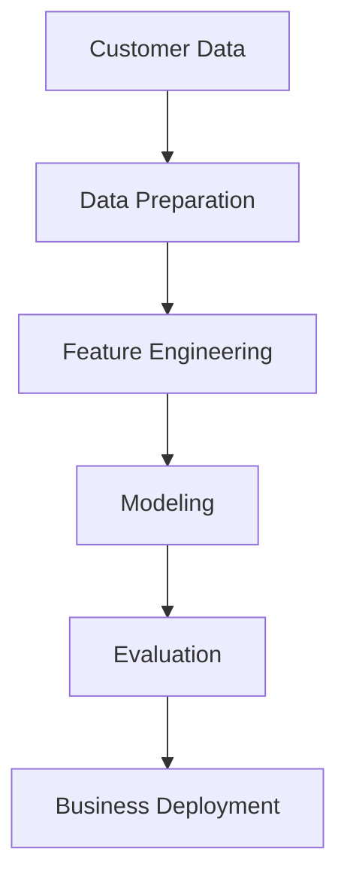

# Life Insurance Cross-Sell Prediction

## 📌 Project Overview
The goal of this project is to build a **predictive model** that identifies which existing insurance customers are most likely to purchase **life insurance** based on their current product portfolio (e.g., home, farm, auto) and customer profile.

This project simulates a real-world use case in insurance analytics: **cross-selling**. By leveraging customer data and external vendor data, we aim to:
- Understand what differentiates customers who adopt life insurance.
- Build a model that predicts the probability of a cross-sell.
- Enable the business to target the right customers at the right time.

---

## 🎯 Problem Statement
- **Business Goal**: Increase life insurance adoption among existing customers.
- **Target Variable**: A binary flag indicating whether a customer acquired life insurance between June 2024 and June 2025.
  - If `#policies_2025 > #policies_2024`, label = **1** (cross-sell success).
  - Else, label = **0**.

---

## 🗂️ Data Sources
1. **Internal Policy Data**  
   - Home Insurance
   - Auto Insurance
   - Farm Insurance

2. **Life Insurance Data**  
   - Baseline and follow-up counts of life insurance policies.

3. **External Vendor Data**  
   - Demographics
   - Credit indicators
   - Socioeconomic features

---

## 🔧 Methodology

### 1. Data Preparation
- Merged multiple insurance product tables at **customer level**.
- Joined with vendor demographic datasets.
- Cleaned missing values and standardized categorical variables.

### 2. Feature Engineering
- Policy characteristics: coverage amount, tenure, claims history.
- Customer profile: age, household size, financial indicators.
- Behavioral: product mix, recency of claims, loyalty features.

### 3. Modeling Approaches
- **Logistic Regression** (baseline)
- **Random Forest**
- **Gradient Boosting Machines (XGBoost/LightGBM)**
- **Model Evaluation**: AUC, Precision-Recall, Business Lift.

---

## 📊 Workflow Diagram


---

## 📈 Results & Insights
- **Best Model**: Gradient Boosting achieved the highest AUC.
- Customers with **multiple property policies** had higher life cross-sell probability.
- **Younger families** and **mid-income households** showed strong adoption.
- Claims-free customers were more receptive to cross-sell offers.

---

## 🚀 Business Impact
- Improved targeting for marketing campaigns.
- Reduced cost per acquisition by focusing on high-probability segments.
- Provided actionable insights for **agent outreach** and **personalized offers**.

---

## 🛠️ Tech Stack
- **Languages**: Python (pandas, scikit-learn, XGBoost, LightGBM)
- **Data**: SQL Server, CSV vendor feeds
- **Visualization**: Matplotlib, Seaborn
- **Documentation**: Markdown, Jupyter Notebooks

---

## 📂 Repository Structure
```
├── data/            # Sample synthetic datasets (no PII)
├── notebooks/       # EDA and modeling
├── src/             # Data prep & modeling scripts
├── results/         # Model outputs, plots
└── README.md        # Project documentation
```

---

## 📌 Next Steps
- Extend to **multi-class targets** (predict product type most likely to be sold).
- Explore **deep learning methods** (tabular transformers).
- Implement **real-time scoring API** for deployment.

---

## 👤 Author
*Data Scientist with expertise in machine learning, insurance analytics, and end-to-end model deployment.*

